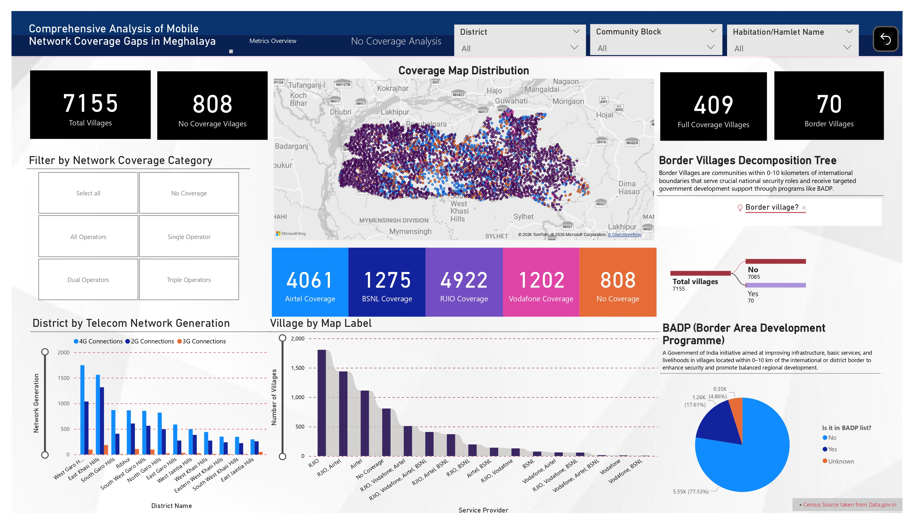
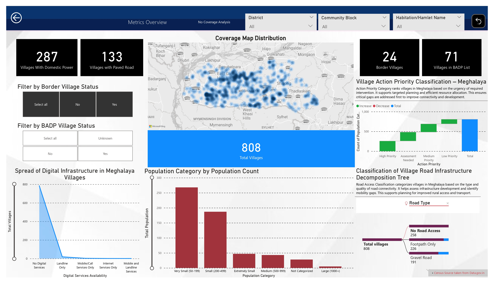

<!-- Header Banner -->
<p align="center">
  
</p>

<p align="center">
  <a href="https://git.io/typing-svg">
    
  </a>
</p>

<p align="center">
  
  <a href="https://github.com/SheldonKjee?tab=followers">
    
  </a>
</p>

<br>

<!-- ═══════════════════════════════════ ABOUT ME ═══════════════════════════════════ -->

<h2 align="center">👨‍💻 About Me</h2>

<p align="center">
  <em>I'm a passionate <strong>Data Science & AI/ML enthusiast</strong>. I specialize in building scalable, production-ready applications that leverage modern frameworks and cutting-edge AI capabilities to solve real-world problems.</em>
</p>

<br>

<div align="center">

| | |
|---|---|
| 📍 **Based in** | Bengaluru, India |
| 🌐 **Open to** | Remote, Hybrid & On-site Opportunities |
| 💼 **Actively Contributing** | Open-source Projects & Data Science Community |

</div>

<br>

```python
class Sheldon_Khongjee:
    def __init__(self):
        self.name = "Sheldon Khongjee"
        self.role = "Data Scientist | AI/ML Engineer | Data Engineer"
        self.location = ["Bengaluru, India 🇮🇳", "Shillong, India 🇮🇳"]
        self.code = ["Python", "R", "Java", "Dart", "SQL"]
        self.ml_frameworks = ["TensorFlow", "Keras", "PyTorch", "Scikit-learn"]
        self.databases = ["MongoDB", "MySQL", "SQLite"]
        self.big_data = ["Hadoop", "Data Warehousing"]
        self.focus_areas = ["Data Science", "Machine Learning", "Artificial Intelligence", 
                           "Data Engineering", "Data Analytics", "Big Data", "Mobile Development"]
    
    def say_hi(self):
        print("Thanks for dropping by! Let's build something amazing together!")
#main
me = Sheldon_Khongjee()
me.say_hi()
```

<br>

---

<!-- ═══════════════════════════════ TECH STACK ═══════════════════════════════ -->

<h2 align="center">🛠️ Tech Stack & Skills</h2>

<h3 align="center">💻 Programming Languages & Applications</h3>
<p align="center">
  
  
  
  
  
  
  
</p>

<h3 align="center">🤖 AI/ML & Data Science</h3>
<p align="center">
  
  
  
  
  
</p>
<p align="center">
  
  
  
  
</p>

<h3 align="center">📦 Big Data & Data Warehousing</h3>
<p align="center">
  
  
  
  
</p>

<h3 align="center">🎨 Frontend & Mobile</h3>
<p align="center">
  
  
  
</p>

<h3 align="center">⚙️ Backend & Databases</h3>
<p align="center">
  
  
  
</p>

<h3 align="center">🔧 Developer Tools & DevOps</h3>
<p align="center">
  
  
  
  
  
</p>
<p align="center">
  
  
  
</p>

---

<!-- ═══════════════════════════════ WHAT I'M WORKING ON ═══════════════════════════════ -->

<h2 align="center">🎯 What I'm Working On</h2>

<div align="center">

| | Focus Area |
|---|---|
| 🔭 | Building scalable **Computer Vision** applications with modern frameworks |
| 🤖 | Integrating **AI/ML capabilities** into production systems |
| 📱 | Developing **cross-platform mobile apps** with Flutter |
| 📊 | Creating **data visualization & analytics** dashboards |
| 📈 | Performing **Data Analytics** to derive actionable insights |
| 🔄 | Building **ETL pipelines** for Data Engineering workflows |
| 🌐 | Contributing to **open-source projects** |

</div>

---

<!-- ═══════════════════════════════ INTERNSHIP ═══════════════════════════════ -->

<h2 align="center">💼 Professional Experience</h2>
<div align="center">

### 🏢 Geospatial Data Analyst Intern  
**Meghalaya Technology Parks Society** · Shillong, Meghalaya  
📅 *Jun 2025 – Jul 2025*
</div>

<div align="center">
  
  
  
<br>
</div>

<div align="center">

| | Key Contributions |
|---|---|
| 📊 | Built **Power BI dashboards** analyzing **7,155 total villages** across Meghalaya districts |
| 🧹 | Cleaned and merged **government datasets** using Excel and Power Query, resolving missing and inconsistent values |
| 🗺️ | Mapped **258 roadless villages** and infrastructure coverage gaps using district and block-level **geospatial filters** |

<br>
</div>

#### 📸 Dashboard Snapshots

<details>
<summary><b>🔍 Click to view — Comprehensive Analysis of Mobile Network Coverage Gaps in Meghalaya</b></summary>
<br>

> **No Coverage Analysis Dashboard**  
> Analyzing 7,155 total villages — identifying 808 with no mobile network coverage, 409 with full coverage, and 70 border villages. Features interactive filters by network coverage category (Airtel, BSNL, RJIO, Vodafone), geospatial coverage map distribution, and BADP (Border Area Development Programme) analysis.

<p align="center">
  
</p>

</details>

<details>
<summary><b>📈 Click to view — Metrics Overview & Village Infrastructure Analysis</b></summary>
<br>

> **Metrics Overview Dashboard**  
> Deep-dive into 808 uncovered villages — 287 with domestic power, 133 with paved roads, 24 border villages, and 71 in BADP list. Includes Village Action Priority Classification, population category breakdown, digital infrastructure spread analysis, and road infrastructure decomposition tree identifying 258 villages with no road access.

<p align="center">
  
</p>

</details>

<br>

---

<!-- ═══════════════════════════════ FEATURED PROJECTS ═══════════════════════════════ -->

<h2 align="center">🚀 Featured Projects</h2>

<br>

<!-- Row 1: Bike Detection + MeghAlert -->
<div align="center">
<table width="100%">
<tr>
<td width="50%" valign="top">

### 🏍️ [Bike Helmet Safety Detection](https://github.com/SheldonKjee/Enhanced-Bike-Helmet-Safety-Detection-Analysis)


Real-time motorcycle helmet detection powered by **YOLOv8** with interactive Streamlit dashboard.

**Tech:** `Python` `YOLOv8` `OpenCV` `Streamlit` `MongoDB`

- ✅ Real-time object detection
- ✅ Smart helmet matching (IoU + Distance)
- ✅ Safety compliance scoring (0-100)
- ✅ Multi-source: Images, Video, Webcam

[](https://github.com/SheldonKjee/Enhanced-Bike-Helmet-Safety-Detection-Analysis)

</td>
<td width="50%" valign="top">

### 🚨 [MeghAlert - Emergency SOS](https://github.com/SheldonKjee/MeghAlert)


Cross-platform emergency alert system with real-time GPS tracking for Meghalaya.

**Tech:** `Flutter` `Node.js` `MongoDB` `WebSocket` `JWT`

- 📱 One-Click SOS alerts
- 📍 Real-time GPS tracking
- 🎛️ Admin live monitoring dashboard
- 🗺️ Interactive Leaflet.js maps

[](https://github.com/SheldonKjee/MeghAlert)

</td>
</tr>
</table>
</div>

<br>

<!-- Row 2: Flight Delay + Weather EDA -->
<div align="center">
<table width="100%">
<tr>
<td width="50%" valign="top">

### ✈️ [Flight Delay Prediction](https://github.com/SheldonKjee/Forecasting-Flight-Delays)


End-to-end analysis and predictive modeling of U.S. flight delays with geospatial viz.

**Tech:** `Python` `R` `Keras` `Scikit-learn` `Cartopy`

- 📊 Comprehensive EDA & correlation
- 🗺️ Geospatial airport visualization
- 🤖 Logistic Regression model
- 📈 Delay pattern analysis

[](https://github.com/SheldonKjee/Forecasting-Flight-Delays)

</td>
<td width="50%" valign="top">

### ⛅ [Karnataka Weather EDA](https://github.com/SheldonKjee/EDA-Framework-For-Understanding-Weather-Variability-In-Karnataka)


Comprehensive weather analysis with ML modeling, clustering & SARIMA forecasting.

**Tech:** `Python` `R` `Keras` `Scikit-learn` `Statsmodels`

- 📥 Data ingestion (CSV → MongoDB)
- 🔍 EDA with outlier detection
- 🧠 Random Forest & Gradient Boosting
- 📈 SARIMA time series forecasting

[](https://github.com/SheldonKjee/EDA-Framework-For-Understanding-Weather-Variability-In-Karnataka)

</td>
</tr>
</table>
</div>

<br>

---

<!-- ═══════════════════════════════ GITHUB STATS ═══════════════════════════════ -->

<h2 align="center">📊 GitHub Stats</h2>

<br>

<p align="center">
  
  
</p>

<p align="center">
  
</p>

<p align="center">
  
</p>

<p align="center">
  
</p>

<div align="center">
  <table>
    <tr>
      <td></td>
      <td></td>
      <td></td>
    </tr>
  </table>
</div>

<br>

---

<!-- ═══════════════════════════════ CURRENTLY LEARNING ═══════════════════════════════ -->

<h2 align="center">🌱 Currently Learning</h2>

<br>

<div align="center">

| | Area | Details |
|---|---|---|
| 🔄 | **MLOps** | Docker, CI/CD pipelines, Model deployment |
| 🧠 | **Advanced Deep Learning** | Transformers, GANs |
| 📱 | **Mobile Development** | Flutter advanced patterns |
| 💼 | **System Design** | Building scalable architectures |
| 📊 | **Alteryx** | Data blending, advanced analytics & workflow automation |
| 🔬 | **KNIME** | Visual data science workflows & machine learning pipelines |

</div>

<br>

---

<!-- ═══════════════════════════════ CONNECT ═══════════════════════════════ -->

<h2 align="center">📫 Let's Connect!</h2>

<br>

<p align="center">
  <a href="https://github.com/SheldonKjee">
    
  </a>
  <a href="mailto:sheldonkjee216@gmail.com">
    
  </a>
  <a href="https://instagram.com/teutonixphere">
    
  </a>
</p>

<br>

---

<!-- Footer -->
<p align="center">
  
</p>

<div align="center">
  <h3>💭 Daily Inspiration</h3>
  <p>🔧 <i>"A man is only as good as his tools."</i> <b>― Emmert Wolf</b></p>
</div>

<p align="center">
  ⭐ <b>From <a href="https://github.com/SheldonKjee">SheldonKjee</a></b> | Feel free to reach out for collaboration!
</p>

<p align="center">
  
</p>

